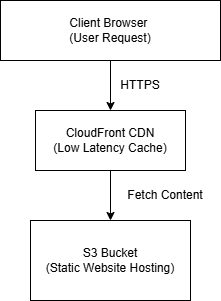

# 🚀 AWS Static Website Hosting with CDN

---

## 📌 Overview
This project demonstrates how to host a static website using Amazon S3 and deliver content globally using CloudFront CDN.

The architecture is serverless, highly scalable, and cost-efficient.
A scalable and cost-efficient static website hosting architecture using AWS S3 and CloudFront CDN.

---

## 🏗 Architecture

User  
↓  
CloudFront (CDN)  
↓  
S3 Bucket (Static Website Hosting) 
- - -
## 🎯 Why This Architecture?

- Reduces latency using CDN
- Improves performance globally
- Eliminates server management
- Highly cost-efficient

---

## 🧰 Services Used

- Amazon S3 → Stores static website files
- CloudFront → Content Delivery Network (CDN)
- Route53 (optional) → Domain management

---

## ⚙️ How It Works

1. User sends request from browser  
2. Request goes to CloudFront CDN  
3. CloudFront fetches content from S3  
4. Content is cached and delivered globally  

---

## 🔐 Security

- S3 bucket access controlled using policies  
- HTTPS enabled via CloudFront  
- No direct public exposure to backend services  

---

## 💰 Cost Optimization

- Uses S3 free tier storage  
- CloudFront caching reduces repeated requests  
- No server cost (fully serverless architecture)  

---

## 📈 Scalability

- Automatically scales based on traffic  
- Handles global users efficiently  
- No manual infrastructure management required  

---

## 📂 Project Structure

aws-static-website-cdn  
│  
├── architecture.png  
└── README.md  

---

## 🧠 Key Learnings

- Static website hosting in cloud  
- CDN performance optimization  
- Serverless architecture design  
- Cost-efficient cloud solutions  

---

## 👨‍💻 Author

Akash  
AWS Certified Solutions Architect – Associate  

GitHub: https://github.com/akashmca29  

---

## ⭐ Conclusion

This project showcases a simple yet powerful cloud architecture for hosting scalable and high-performance static websites using AWS services.
